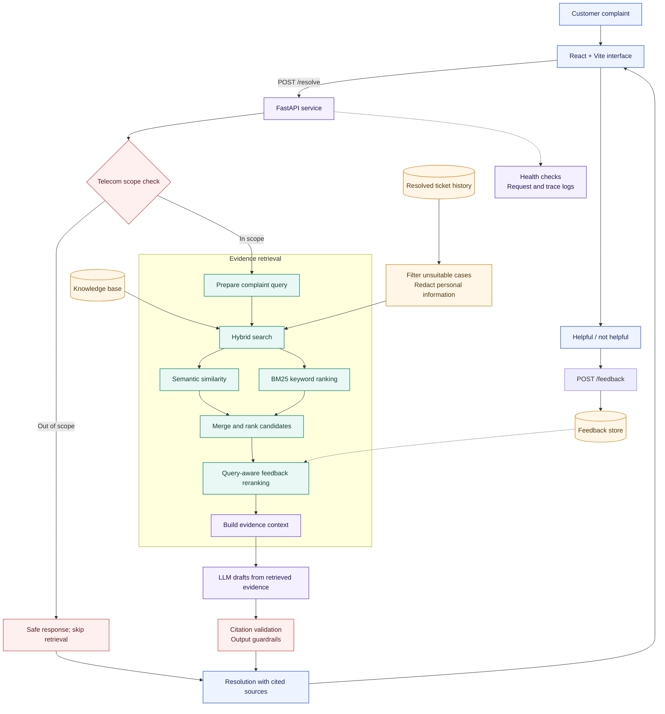

# Nexolve Resolution Copilot

<p align="center">
  
</p>

<p align="center">
  
  
  
  
</p>


<p align="center">
  <strong>Turn a customer complaint into evidence-backed support guidance.</strong><br/>
  A semantic support assistant for telecom service teams.
</p>

<p align="center">
  <em>Understand the issue · Find relevant history · Draft a grounded next step</em>
</p>

---

## Why this project exists

Support agents often search old cases with a few keywords. That works when customers use the same words as the ticket title; it misses when they describe the same fault differently.

A customer might say, “My broadband drops every evening while I’m working.” A useful assistant should recognize the connectivity problem, retrieve relevant support articles and resolved cases, and help the agent respond with clear steps grounded in those sources.

Nexolve Resolution Copilot is designed to make that workflow faster while keeping the evidence visible. It is an assistant for support staff: retrieved sources inform the recommendation, and the agent remains responsible for reviewing it.

## What it does

- Accepts a free-text customer complaint in a web interface.
- Extracts useful complaint signals such as product, issue category, severity, and sentiment.
- Searches support knowledge and historical resolved tickets using semantic and lexical retrieval.
- Uses query-aware feedback signals to adjust rankings for similar future complaints.
- Drafts a step-by-step response from retrieved evidence.
- Returns visible source references and validates citations against retrieved evidence.
- Applies telecom scope and response guardrails, with safe handling when evidence is insufficient.
- Captures helpfulness feedback and exposes service health and request diagnostics.

## Architecture

The diagram shows the intended request and feedback flow. It intentionally omits dataset counts.



### Request lifecycle

1. The customer complaint enters through the web application.
2. The API checks whether the issue is in the supported telecom domain.
3. For an in-scope complaint, the retrieval layer searches support articles and eligible resolved cases using semantic and BM25 signals.
4. Feedback from similar queries can influence ranking. Retrieved evidence is assembled as the only factual basis for the generated recommendation.
5. The answer is checked for valid source citations and safe output before it is returned.
6. The UI presents the resolution and its knowledge sources; the customer or agent can rate whether it helped.

## Grounding and safety

The assistant should prefer a useful abstention over a confident answer without evidence.

- **Source-grounded generation:** recommendations should be based on retrieved material, not invented telecom procedures.
- **Citation validation:** source identifiers in the answer must correspond to sources actually retrieved for that request.
- **Evidence threshold:** if retrieval does not find sufficiently relevant material, the response should explain the evidence gap and avoid specific unsupported troubleshooting.
- **Domain scope:** non-telecom complaints should be routed to a safe out-of-scope response without presenting unrelated telecom articles as relevant.
- **Ticket hygiene:** exclude unsuitable historical cases and remove personal information before indexing or using ticket text.
- **Human review:** agents should verify actions that affect accounts, billing, equipment, or service status.

## Additional exploration

The system is designed to evolve as customer language, products, and ticket classes change.

### Retrieval experiments

Compare lexical BM25, semantic similarity, and hybrid retrieval on the same labeled complaint set. Include paraphrases, spelling mistakes, short complaints, and complaints with multiple symptoms. Track which source type—article or historical case—provides the strongest evidence.

### Feedback-aware ranking

Use helpful and not-helpful feedback as a ranking signal for semantically similar future queries. Keep this signal bounded: feedback should adjust candidate ordering, not override relevance, source quality, domain scope, or safety rules. Log the ranking version so experiments can be compared and rolled back.

### Evolving taxonomy and data

Monitor new product names, issue categories, and emerging ticket clusters. Add a controlled ingestion path that validates records, redacts sensitive fields, deduplicates cases, and refreshes indexes. Version the corpus and taxonomy so results can be traced to the data that produced them.

### Out-of-domain and low-evidence behavior

Include deliberate negative examples—such as vehicle repair, medical, or unrelated consumer questions—in evaluation. The expected behavior is to decline domain-specific guidance and avoid displaying unrelated retrieved sources as supporting evidence.

## Evaluation: quality and system health

<p align="center">
  
</p>


The figures below are taken from the evaluation artifacts in your project folder (data/eval/retrieval_results.json and data/eval/answer_results.jsonl). The retrieval results are a measured run of the project hybrid retriever on its synthetic labeled benchmark; they are not production traffic metrics.

| Area | What to measure | Observed project result | Why it matters |
|---|---|---|---|
| Retrieval relevance | Recall@k, MRR, nDCG | **400 synthetic complaint queries:** Recall@1 **56.8%**, Recall@3 **77.0%**, Recall@5 **84.3%**; MRR **0.672**, nDCG@5 **0.715** | Relevant knowledge articles appear near the top |
| Retrieval latency | p50 / p95 retrieval time | **46.2 ms / 91.1 ms** across the recorded offline run; max **226.3 ms** | Indicates local retrieval cost only; not end-to-end service latency |
| Answer generation | Successful answer runs | **1 of 5 (20%)**; **4 of 5** failed with provider rate limits | The sample is too small and rate-limited to claim reliable generation |
| Citation validation | Citation presence and retrieved-ID validity | **1 of 1 generated answer (100%)** had a citation and all cited IDs were retrieved; this checks ID validity, not whether the cited source truly supports every claim | Generated steps need to point to real retrieved evidence |
| Past-ticket source coverage | Relevant resolved-ticket hit rate by rank | **Not measured** by this KB-labeled retrieval benchmark | Past-ticket retrieval needs its own labeled relevance set |
| Abstention and scope | Out-of-scope rejection and low-evidence abstention | **Not measured** | Confirms the assistant avoids irrelevant or unsupported guidance |
| Complaint understanding | Intent/category, product, severity, sentiment accuracy | **Not measured** in the bundled run | Parsed signals support routing and analysis |
| Feedback reranking | Ranking lift on similar-query cohorts | **Not measured**; the bundled feedback sample is insufficient for a lift claim | Feedback should improve ordering without harming relevance |
| Production reliability | Concurrent p50/p95, timeout rate, error rate, availability | **Not measured** | Local offline timing is not a production service-level result |
| Operations | Index freshness, ingestion failures, token use, cost per resolution | **Not measured** | The service must stay current and sustainable |

**Measurement note:** I used the metrics saved by your actual project. I could not freshly rerun the embedding evaluation here: the project virtual-environment launcher points to a missing Python installation, and the available fallback runtime does not have sentence-transformers installed. The answer results also record provider rate limits. I did not modify the Git repository. Re-run `python -m scripts.eval_retrieval` in a working project environment to refresh retrieval metrics, then re-run answer and citation evaluation with a healthy configured LLM provider.

### Suggested evaluation gates

- Build a human-reviewed set of in-domain, ambiguous, out-of-domain, and low-evidence complaints.
- Keep query-level train/evaluation separation when tuning feedback reranking.
- Require valid citations for every substantive recommendation.
- Review false-safe answers and false refusals separately.
- Compare each release against a fixed baseline and investigate regressions by product and issue category.
- Include API contract checks for successful resolution, abstention, out-of-scope response, and feedback submission.

## Production scale considerations

### Retrieval and data

- Move from in-process indexes to a managed vector store or search service when corpus size, concurrency, or update frequency requires it; retain lexical retrieval for exact product codes and known terms.
- Use approximate nearest-neighbor search, metadata filters, and bounded candidate sets to control latency.
- Ingest changes asynchronously. Validate, redact, deduplicate, and version documents before publishing a new index.
- Keep ticket and knowledge-article permissions and retention rules separate where required.
- Support index rebuilds and rollback to a known-good corpus snapshot.

### Service reliability

- Keep the API stateless and scale it horizontally behind a load balancer.
- Put LLM calls behind timeouts, bounded retries, rate limits, and circuit breakers. Return a clear evidence-based fallback if the provider is unavailable.
- Cache safe, repeatable retrieval work where appropriate; do not cache responses containing customer-specific data without a reviewed privacy design.
- Add request IDs, structured logs, distributed traces, and metrics while avoiding complaint text and personal data in logs.
- Protect endpoints with authentication, authorization, input-size limits, abuse controls, and secrets management.

### Model and feedback governance

- Pin and record embedding, reranker, prompt, and generation model versions.
- Treat feedback as untrusted input; rate-limit it, deduplicate it, and monitor for manipulation or drift.
- Use offline evaluation and staged rollout before a ranking or model change reaches all agents.
- Track source freshness and answer quality together; a fluent answer over stale evidence is still a failure.

## Technology

- **Web UI:** React and Vite
- **API:** Python and FastAPI
- **Retrieval:** Sentence Transformers embeddings and BM25 lexical search
- **Generation:** configured LLM provider (Groq in the reviewed setup)
- **Operations:** health endpoint, structured request logs, and evaluation-driven monitoring

Confirm exact dependency versions and provider configuration in the project’s environment files before deployment.

## Run locally

Use the project’s existing environment and instructions as the source of truth for dependencies and environment variables.

Typical development commands:

```powershell
# From the project root: start the API
uvicorn app.main:app --reload --host 127.0.0.1 --port 8000
```

```powershell
# From the frontend directory: install dependencies once, then start the UI
npm install
npm run dev -- --port 5174
```

Configure the frontend API URL to point to the local API, and configure the backend’s LLM credentials using the project’s environment settings. Never commit secrets. If your project scripts use different paths or commands, follow those instead.

## Current implementation check

Before describing the full workflow as production-active, verify that the telecom scope guard is called before retrieval and that the frontend feedback payload matches the API feedback schema. Run the API and UI together, then confirm that an out-of-scope complaint returns no irrelevant sources, an in-scope complaint shows both source metadata and citations, and helpfulness feedback is accepted.

---

<p align="center">
  <sub>Evidence first. Clear next steps. Better support conversations.</sub>
</p>


