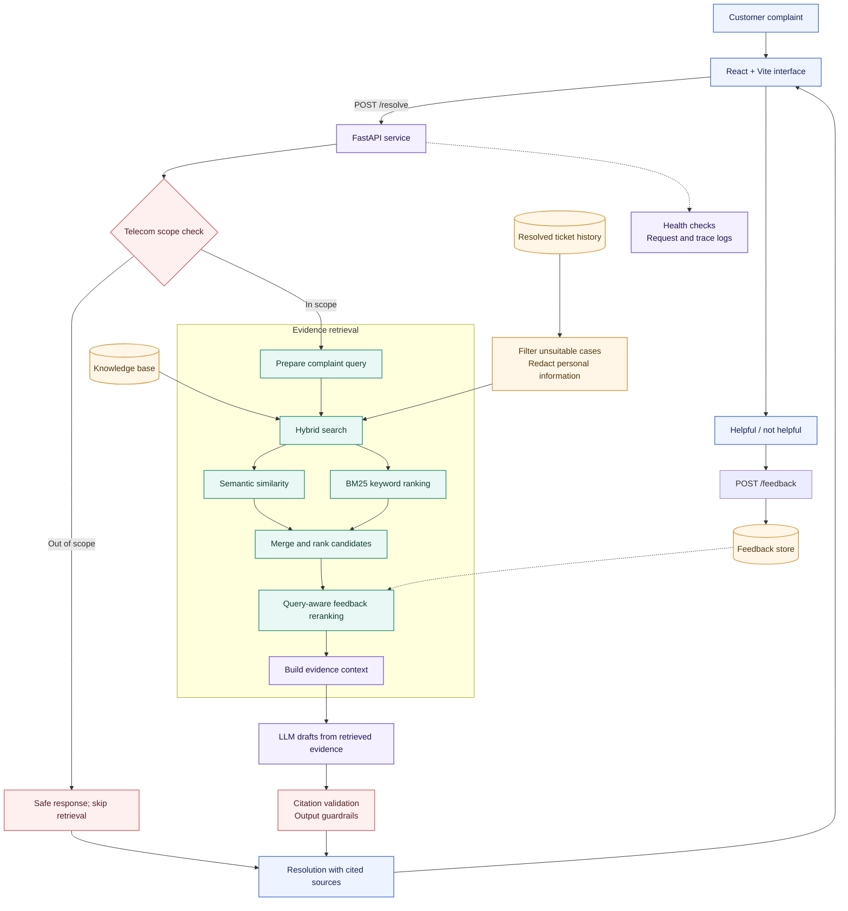

<div align="center">
# Nexolve Resolution Copilot
</div>

<p align="center">
  
  
  
  
</p>


<p align="center">
  <strong>Turn a customer complaint into evidence-backed support guidance.</strong><br/>
  A semantic support assistant for telecom service teams.
</p>

<p align="center">
  <em>Understand the issue · Find relevant history · Draft a grounded next step</em>
</p>

---

## Why this project exists

Support agents often search old cases with a few keywords. That works when customers use the same words as the ticket title; it misses when they describe the same fault differently.

A customer might say, “My broadband drops every evening while I’m working.” A useful assistant should recognize the connectivity problem, retrieve relevant support articles and resolved cases, and help the agent respond with clear steps grounded in those sources.

Nexolve Resolution Copilot is designed to make that workflow faster while keeping the evidence visible. It is an assistant for support staff: retrieved sources inform the recommendation, and the agent remains responsible for reviewing it.

## What it does

- Accepts a free-text customer complaint in a web interface.
- Extracts useful complaint signals such as product, issue category, severity, and sentiment.
- Searches support knowledge and historical resolved tickets using semantic and lexical retrieval.
- Uses query-aware feedback signals to adjust rankings for similar future complaints.
- Drafts a step-by-step response from retrieved evidence.
- Returns visible source references and validates citations against retrieved evidence.
- Applies telecom scope and response guardrails, with safe handling when evidence is insufficient.
- Captures helpfulness feedback and exposes service health and request diagnostics.

## Architecture

The diagram shows the intended request and feedback flow. It intentionally omits dataset counts.



### Request lifecycle

1. The customer complaint enters through the web application.
2. The API checks whether the issue is in the supported telecom domain.
3. For an in-scope complaint, the retrieval layer searches support articles and eligible resolved cases using semantic and BM25 signals.
4. Feedback from similar queries can influence ranking. Retrieved evidence is assembled as the only factual basis for the generated recommendation.
5. The answer is checked for valid source citations and safe output before it is returned.
6. The UI presents the resolution and its knowledge sources; the customer or agent can rate whether it helped.

## Grounding and safety

The assistant should prefer a useful abstention over a confident answer without evidence.

- **Source-grounded generation:** recommendations should be based on retrieved material, not invented telecom procedures.
- **Citation validation:** source identifiers in the answer must correspond to sources actually retrieved for that request.
- **Evidence threshold:** if retrieval does not find sufficiently relevant material, the response should explain the evidence gap and avoid specific unsupported troubleshooting.
- **Domain scope:** non-telecom complaints should be routed to a safe out-of-scope response without presenting unrelated telecom articles as relevant.
- **Ticket hygiene:** exclude unsuitable historical cases and remove personal information before indexing or using ticket text.
- **Human review:** agents should verify actions that affect accounts, billing, equipment, or service status.

## Exploration & Production Grade Consideration

The system is designed to evolve as customer language, products, and ticket classes change.

## Resolution Design

A reliable support assistant needs more than a *retrieve → prompt → LLM* pipeline. Nexolve uses multiple stages to find relevant evidence, protect customer information, account for agent feedback, validate generated guidance, and handle cases where the evidence is not strong enough.

Hallucinations are controlled through **grounding, validation, and fallback**—rather than assuming the LLM will always be correct.

### 🔵 Weighted hybrid retrieval
Nexolve combines dense semantic search with BM25 lexical retrieval. Semantic search can recognize complaints that describe the same fault in different words, while lexical search helps surface exact product names, error messages, and technical terms. Weighted results bring both kinds of matches into the ranking.

### 🔵 Query-aware feedback reranking
Helpfulness feedback is considered in the context of the current complaint. Feedback from similar past queries can strengthen relevant candidates, while feedback from unrelated issues has less influence. This helps improve ranking without turning globally popular articles into default answers.

### 🔵 PII redaction
Personal information in ticket data is redacted before it is indexed or used as retrieval context. This reduces the risk of exposing customer details in search results, prompts, logs, or generated responses.

### 🔵 Citation validation
Retrieved source IDs are carried through the generation process. Before an answer is returned, its citations are checked against the sources retrieved for that request. This helps prevent the assistant from citing articles or tickets it did not actually use.

### 🔵 RAG guardrails
The system checks whether the retrieved evidence is relevant and sufficient, then validates the generated response. When an output fails validation, it can attempt a controlled repair. If the evidence still cannot support a safe, specific recommendation, the assistant returns a limited-evidence response instead.

### 🔵 Failure-aware LLM pipeline
LLM providers can time out, apply rate limits, or become temporarily unavailable. The pipeline handles these failures explicitly and avoids silently presenting unsupported guidance as a successful resolution.

> **Design principle**  
> *Redact sensitive data → retrieve broadly → rerank for the current query → generate from retrieved evidence → validate the answer and citations → fall back or abstain when evidence is insufficient.*

## 📊 Evaluation Results

The system was evaluated across retrieval quality, retrieval latency, and
citation validity.

| Metric | Observed Result | What it measures |
|---|---:|---|
| **Recall@1 (R@1)** | **56.75%** | Percentage of queries where the relevant article was ranked first |
| **Recall@3 (R@3)** | **77.00%** | Percentage of queries where the relevant article appeared in the top 3 |
| **Recall@5 (R@5)** | **84.25%** | Percentage of queries where the relevant article appeared in the top 5 |
| **nDCG@5** | **0.7146** | Quality of the ranking within the top 5 results |
| **Retrieval Latency** | **p50: 46.2 ms · p95: 91.1 ms** | Retrieval-stage latency in the recorded offline run |
| **Citation Validity** | **70% (14/20)** | Percentage of evaluated answers that contained valid citations to retrieved evidence |

### Evaluation Scope

- **Retrieval:** 400 synthetic complaint queries
- **Latency:** recorded offline retrieval run
- **Citation evaluation:** 20 generated answers (testing purpose)
- Citation validity checks whether cited knowledge-base IDs correspond to
  retrieved evidence.

> **Note:** Retrieval metrics and citation validity measure different stages of
> the pipeline and should not be interpreted as a single overall accuracy
> score.

## Run locally

Clone the repository

```powershell
git clone https://github.com/Thanushree4104/nexolve-resolution-copilot.git
cd nexolve-resolution-copilot
```
Create a `.env` file from the project’s example, if provided, and add the required LLM credentials. Never commit secrets. [
```markdown
## Run locally

Clone the repository:

```powershell
git clone https://github.com/Thanushree4104/nexolve-resolution-copilot.git
cd nexolve-resolution-copilot
```

Create a `.env` file in the project root and add your Groq credentials and model settings:

```env
GROQ_API_KEY=your_groq_api_key
LLM_PROVIDER=groq
GROQ_MODEL=openai/gpt-oss-120b
```

Replace `your_groq_api_key` with your own API key. Keep `.env` private and never commit it.

Make sure Docker Desktop is running. From the project root, start the application:

```powershell
docker compose up --build
```

Open **http://localhost:5173**. 

To stop the services with `Ctrl+C`, or run `docker compose down` from the project directory.
```

---

<p align="center">
  <sub>Evidence first. Clear next steps. Better support conversations.</sub>
</p>


